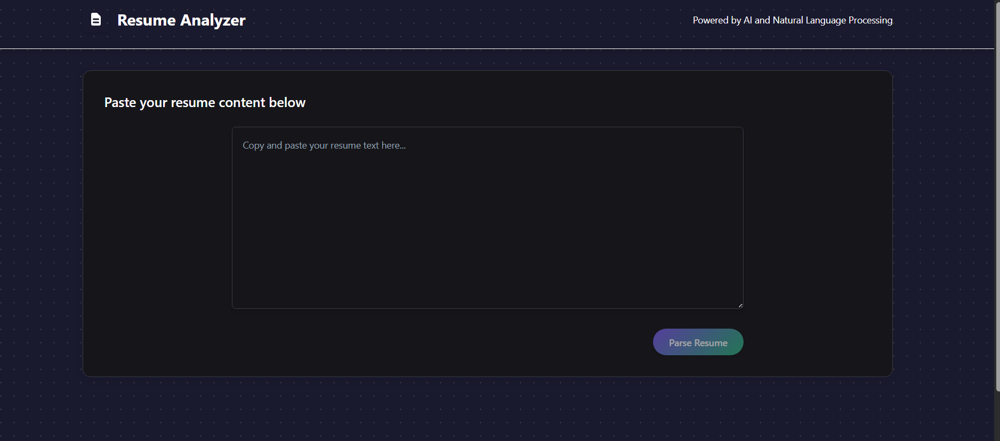
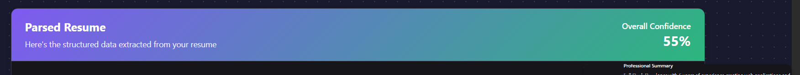
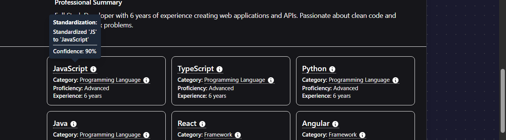
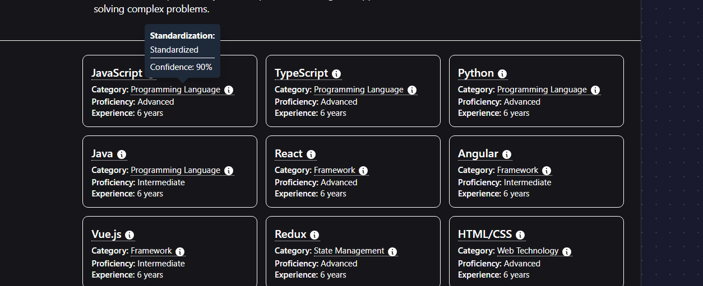

# Resume Analyzer: Intelligent Resume Parser with Confidence Scoring



Welcome to the Resume Analyzer project! This AI-powered tool extracts structured, validated data from unstructured resume content with a unique confidence scoring mechanism that sets it apart from standard parsers.

## Key Features

- **🎯 Advanced Confidence Scoring**: Every extracted field includes a confidence score (0-1) with visual indicators
- **🔄 Intelligent Standardization**: Automatically normalizes job titles, skill names, and degree formats with transformation notes
- **⚠️ Field Validation**: Identifies inconsistencies, overlaps, and missing information
- **🧠 Multi-stage Parsing**: Three-phase extraction with fallback mechanisms for challenging content
- **🎨 Rich Visualization**: Clear, intuitive UI showing confidence levels and standardization details
- **🚀 Edge Case Handling**: Specialized processing for non-standard resume formats
- **⚡ High Performance**: Built on modern serverless architecture for unlimited processing time

## Architecture Overview

### Core Architecture

This solution implements a hybrid architecture optimized for rapid deployment and maximum performance:

- **Frontend**: Next.js deployed on Vercel - providing a clean UI with React Server Components
- **Backend API**: ValTown serverless functions - giving us unlimited runtime for LLM operations
- **LLM Integration**: OpenAI GPT-4o for high-quality structured data extraction
- **Storage**: In-memory for demo purposes with documented path to Supabase implementation

This architecture was specifically chosen to maximize development velocity while demonstrating production-ready thinking. The ValTown backend eliminates the typical timeout issues that plague serverless platforms when dealing with LLM operations.

### Backend (ValTown + Hono)

The backend uses a three-step parsing process:

1. **Initial Extraction**: OpenAI GPT-4o parses the resume with structured output
2. **Validation & Standardization**: Field validation with terminology standardization
3. **Confidence Scoring**: Detailed confidence assessment for each extracted field

Key components:
- `resumeParser.ts`: Core extraction logic and post-processing
- `openai.ts`: LLM integration with retry mechanisms
- `resumePrompts.ts`: Specialized prompts for different extraction phases
- `resumeSchemas.ts`: Zod schemas for validation and OpenAPI docs

#### ValTown API Services with Hono Framework

ValTown provides a powerful serverless JavaScript/TypeScript runtime that's perfectly suited for Hono - a lightweight (~14KB) web framework built on Web Standards. This combination gives us:

- **Unlimited Runtime for LLM Ops**: No 10-second timeout limitations that plague other serverless platforms
- **Ultra-Fast Routing**: Hono's RegExpRouter delivers performance other frameworks can't match
- **Zero Configuration Deployment**: Instant API endpoints without infrastructure setup
- **TypeScript-Native**: Full type safety across your entire API surface
- **Middleware Power**: Hono's middleware ecosystem for validation, auth, and error handling
- **Multi-Runtime Compatibility**: Code that can be easily ported to AWS when ready

### Frontend (Next.js)

The frontend provides an intuitive interface with:

- **Resume Input**: Clean text input area for pasting resume content
- **Confidence Visualization**: Color-coded indicators for confidence levels
- **Standardization Tooltips**: Hover-to-see details of standardized fields
- **Missing Fields Alert**: Clear identification of information not found
- **Section Organization**: Structured display of all parsed resume components

We're leveraging Next.js 14 with App Router for our frontend because:

- Server Components reduce client-side JavaScript
- Built-in form validation and state management
- Optimized deployment on Vercel
- TypeScript support for type safety

### LLM Integration Strategy

Our parsing approach uses a strategic pattern with OpenAI's GPT-4o:

- **Initial extraction**: Structured data extraction with confidence assessment
- **Retry mechanism**: Focused re-parsing when initial extraction has low confidence
- **Validation pass**: Standard terminology and format verification
- **Confidence scoring**: Built into the prompt architecture for field-level reliability

## Confidence Scoring: Our Key Differentiator

Our confidence scoring mechanism uniquely addresses the limitations of traditional resume parsers:








### How It Works

1. Each extracted field receives a confidence score (0-1) based on:
   - Pattern recognition and format validation
   - Terminology standardization success
   - Cross-reference with other resume sections
   - LLM's assessment of extraction accuracy

2. Scores are visualized through:
   - Color-coding (green: high confidence, yellow: medium, red: low)
   - Numerical percentage indicators
   - Hover tooltips with confidence details
   - Standardization notes showing transformations

3. Users gain immediate insight into:
   - Which fields were confidently extracted vs. uncertain
   - Where standardization was applied and how
   - Potential issues requiring manual review
   - Overall quality assessment of the parsed resume

This confidence scoring system empowers recruiters to make informed decisions about the reliability of extracted data, eliminating the "black box" problem of traditional parsers.

## Technical Decisions and Tradeoffs

### ValTown for Backend

**Advantages:**
- Greater runtime for LLM operations (10 minutes timeout)
- Zero configuration deployment
- TypeScript-native environment

**Tradeoffs:**
- Limited ecosystem compared to AWS/GCP
- Restricted to JavaScript/TypeScript

### OpenAI GPT-4o

**Advantages:**
- Excellent structured data extraction capabilities
- Strong understanding of resume formats and conventions
- Ability to handle different resume layouts
- Multi-stage parsing with built-in retry for challenging content

**Tradeoffs:**
- API costs for production use
- Small potential for hallucination in ambiguous cases

### Next.js Frontend

**Advantages:**
- Server Components reduce client-side JavaScript
- Built-in API routes
- TypeScript support

**Tradeoffs:**
- Larger bundle size than minimal frameworks
- Learning curve for App Router

## Setup and Deployment Instructions

### Local Development

#### Backend (ValTown)

1. Install Val Town CLI:
   ```bash
   deno install -grAf jsr:@valtown/vt
   ```

   Or if you would prefer a more descriptive command with minimal permissions:

   ```bash
   deno install --global --force --reload --allow-read --allow-write --allow-env --allow-net jsr:@valtown/vt
   ```

2. Authenticate with Val Town:
   ```bash
   vt auth
   ```

   You should get the dialog:

   ```
   Welcome to the Val Town CLI!

     VT is a companion CLI to interface with Val Town Vals.

     With this CLI, you can:
     - Create and manage Val Town Vals
     - Push and pull changes between your local system and Val Town
     - Watch a directory to keep it automatically synced with Val Town
     - And more!

     To get started, you need to authenticate with Val Town.

   ? Would you like to open val.town/settings/api in a browser to get an API key? (y/n) ›
   ```

   Respond yes, and ensure you select to create an API key with user read & val read+write permissions.

   Alternatively, you can set the `VAL_TOWN_API_KEY` environment variable to authenticate.

3. Clone the repository and navigate to the backend directory:
   ```bash
   git clone https://github.com/your-username/resume-analyzer.git
   cd resume-analyzer/backend
   ```

4. Set up environment variables:
   Create a `.env` file with:
   ```
   OPENAI_API_KEY=your_openai_key
   ```

5. Push your backend to Val Town:
   ```bash
   vt push
   ```

#### Frontend (Next.js)

1. Navigate to the frontend directory:
   ```bash
   cd ../frontend
   ```

2. Install dependencies:
   ```bash
   npm install
   ```

3. Create `.env.local` file with:
   ```
   NEXT_PUBLIC_API_URL=https://your-val.val.run/api
   ```

4. Start development server:
   ```bash
   npm run dev
   ```

### Production Deployment

#### Backend (ValTown)

1. Deploy to ValTown:
   ```bash
   vt deploy
   ```

2. Set your production environment variables in the ValTown dashboard.

#### Frontend (Vercel)

1. Push your code to GitHub.

2. Connect your repository in the Vercel dashboard.

3. Set the following environment variables:
   - `NEXT_PUBLIC_API_URL`: Your production ValTown API URL

4. Deploy with the Vercel dashboard or CLI:
   ```bash
   vercel --prod
   ```

## Development Workflow

To manage code between local development and Val Town, we need to run the following commands:

```bash
git commit -m "Your commit message"
git push
vt push
```

This ensures that your code is both tracked in version control and deployed to Val Town's serverless environment.

## Sample Usage

1. **Input Resume**: Paste your resume text into the input area.
2. **Process**: Click "Parse Resume" to send to the backend for analysis.
3. **Review Results**: Examine the parsed data with confidence indicators.
4. **Explore Details**: Hover over fields to see standardization notes and confidence scores.
5. **Check Missing Fields**: Review any information that couldn't be extracted.

## Testing

The system has been tested against various resume formats including:
- Standard chronological resumes
- Skills-based resumes
- Academic CVs
- Freelancer portfolios
- Career transition resumes

## Future Improvements

- **Advanced Caching**: Implement caching for similar resume patterns to improve performance
- **Database Integration**: Replace in-memory storage with Supabase for persistence
- **PDF Support**: Add capability to directly upload and parse PDF resumes
- **Prompt Refinements**: Update Prompts to indicate and look deeper with reasoning models
- **ATS Integration**: Develop connectors for popular Applicant Tracking Systems
- **Batch Processing**: Add capability for parsing multiple resumes simultaneously
- **Industry-Specific Models**: Create specialized parsers for different industries
- **User Feedback Loop**: Implement mechanism to learn from user corrections
- **Better confidence scores**: Move away from default confidence score and calculation so that calculation isn't biased
- **Mathematical access to Prompts**: So that they can confidently output proper calculations

---

Built with ❤️ using Next.js, ValTown, Hono, and OpenAI